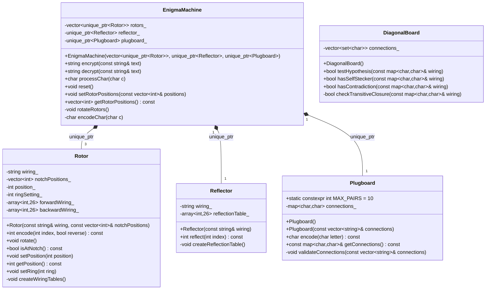
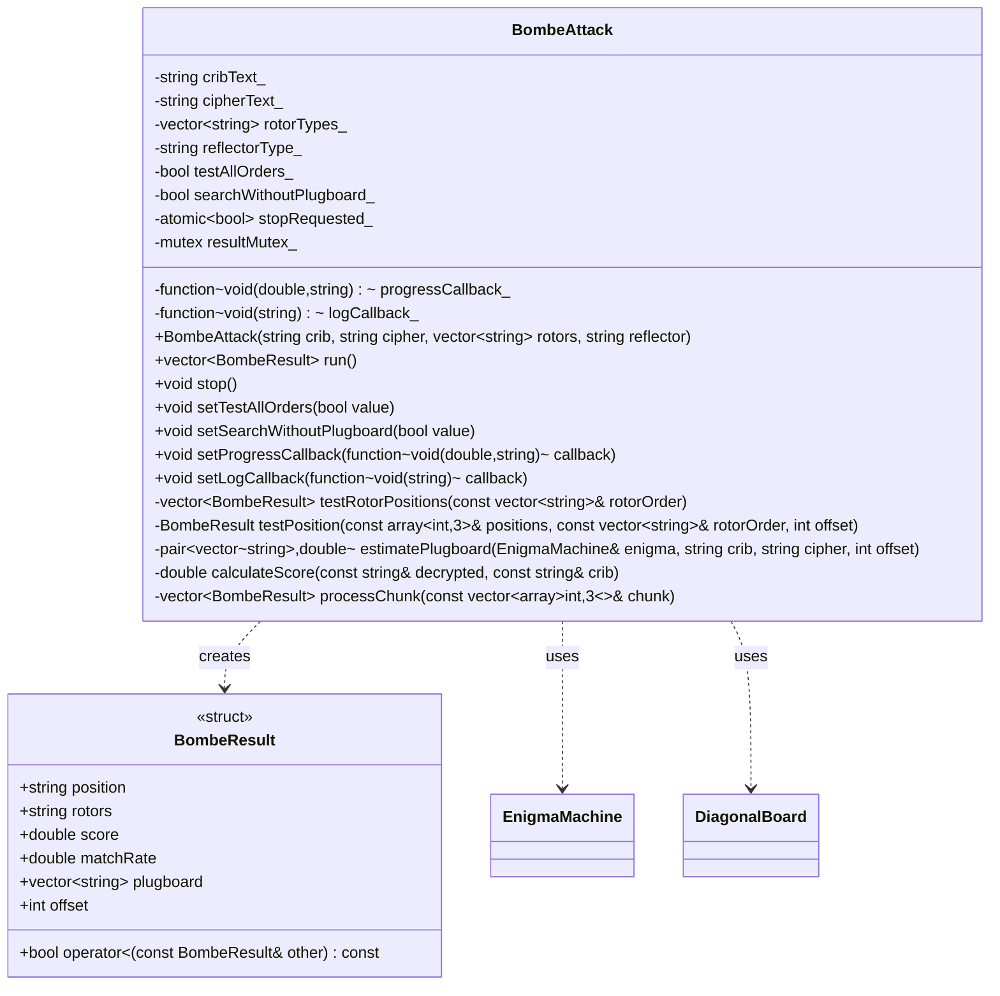
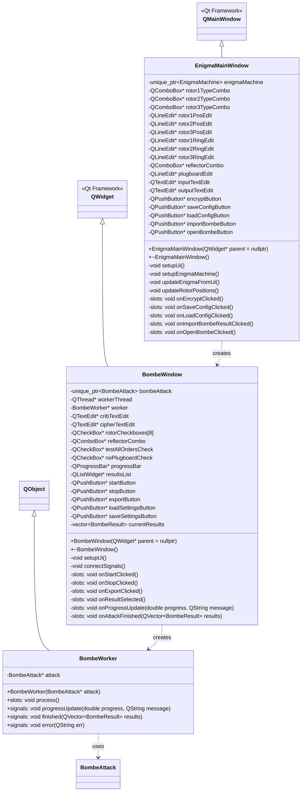
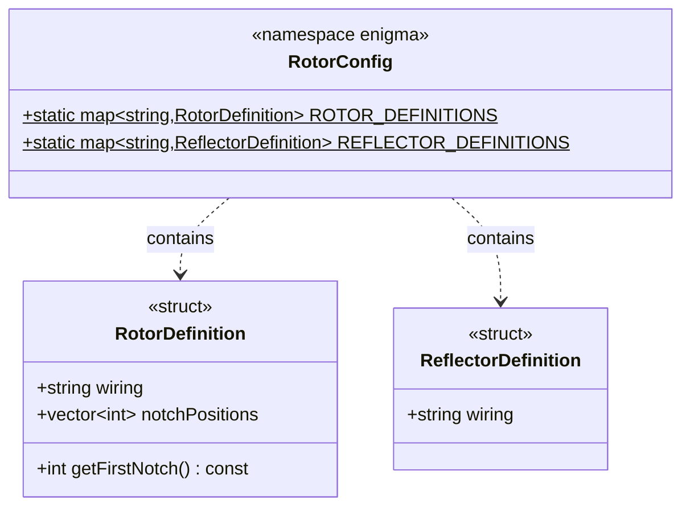
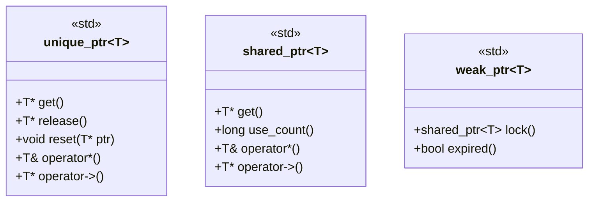
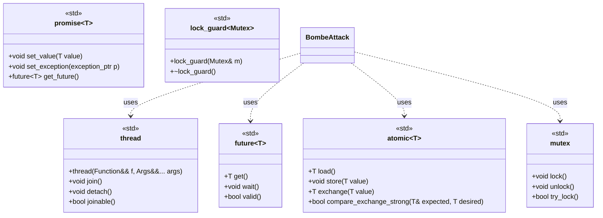
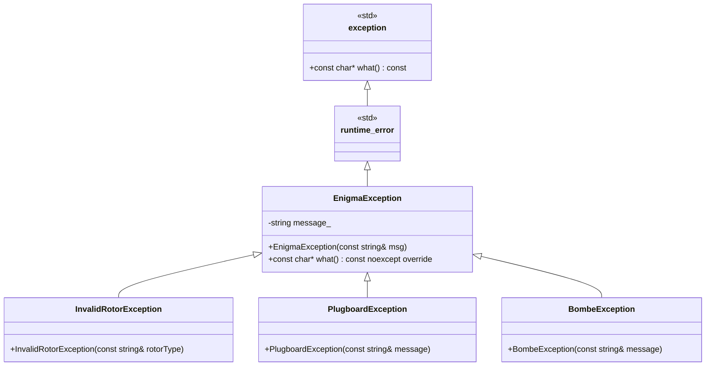
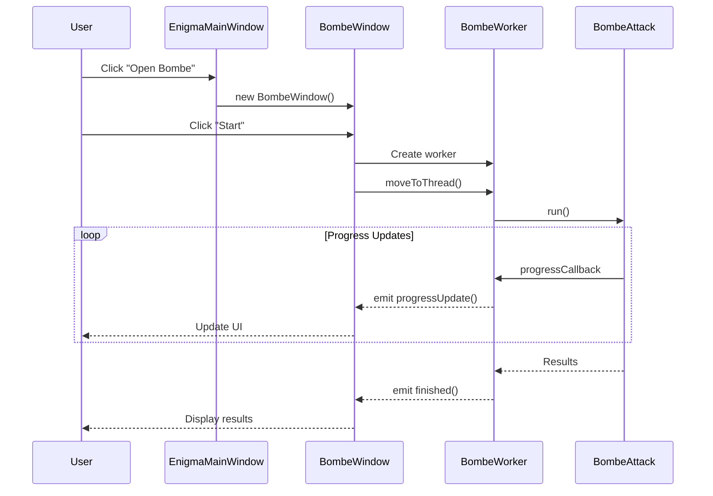
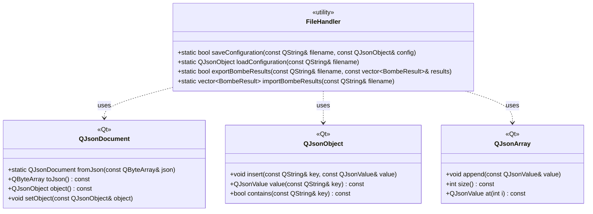

# Enigma Machine & Bombe Simulator - C++版クラス図

## 1. コアコンポーネント（core/）



## 2. Bombe攻撃コンポーネント（bombe/）



## 3. GUI コンポーネント（gui/）- Qt



## 4. 設定管理（core/）



## 5. メモリ管理とスマートポインタ



## 6. 並列処理構造



## 7. エラー処理階層



## 8. Qt シグナル/スロット接続



## 9. ファイルI/O構造



## 10. 定数定義

```mermaid
classDiagram
    class Constants {
        <<namespace>>
        +static constexpr int ALPHABET_SIZE = 26
        +static constexpr char FIRST_LETTER = 'A'
        +static constexpr int MAX_PLUGBOARD_PAIRS = 10
        +static const char* DEFAULT_REFLECTOR = "B"
        +static const char* DEFAULT_ROTORS[] = {"I", "II", "III"}
    }

    class WiringDefinitions {
        <<namespace>>
        +static const char* ROTOR_I = "EKMFLGDQVZNTOWYHXUSPAIBRCJ"
        +static const char* ROTOR_II = "AJDKSIRUXBLHWTMCQGZNPYFVOE"
        +static const char* ROTOR_III = "BDFHJLCPRTXVZNYEIWGAKMUSQO"
        +static const char* ROTOR_IV = "ESOVPZJAYQUIRHXLNFTGKDCMWB"
        +static const char* ROTOR_V = "VZBRGITYUPSDNHLXAWMJQOFECK"
        +static const char* ROTOR_VI = "JPGVOUMFYQBENHZRDKASXLICTW"
        +static const char* ROTOR_VII = "NZJHGRCXMYSWBOUFAIVLPEKQDT"
        +static const char* ROTOR_VIII = "FKQHTLXOCBJSPDZRAMEWNIUYGV"
        +static const char* REFLECTOR_B = "YRUHQSLDPXNGOKMIEBFZCWVJAT"
        +static const char* REFLECTOR_C = "FVPJIAOYEDRZXWGCTKUQSBNMHL"
    }
```

## 11. パフォーマンス最適化ポイント

1. **インライン関数**: 頻繁に呼ばれる小さな関数
2. **const正確性**: コンパイラ最適化のヒント
3. **ムーブセマンティクス**: 不要なコピーの削減
4. **配列ベース**: `std::array`による固定サイズ最適化
5. **並列処理**: `std::async`による非同期実行
6. **キャッシュ最適化**: データ局所性の向上