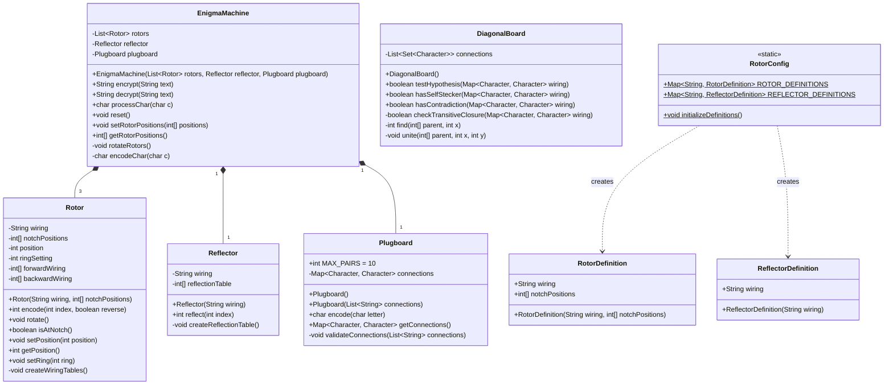
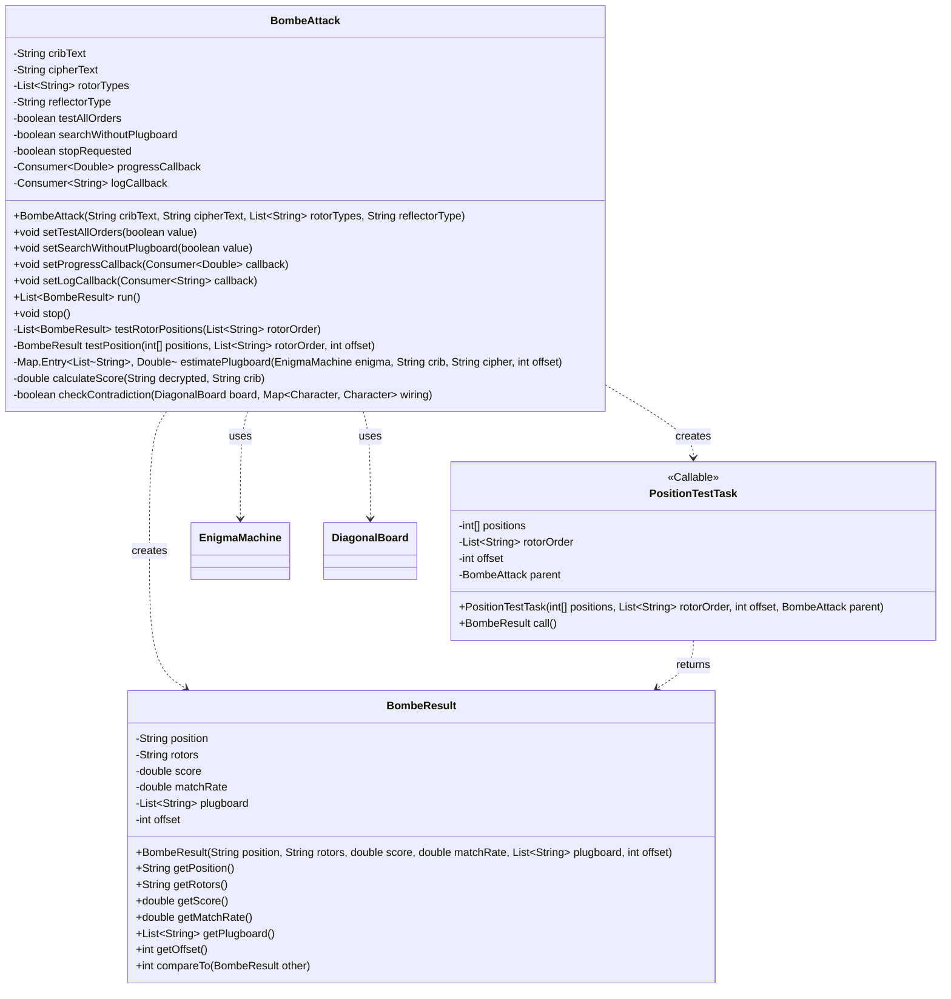
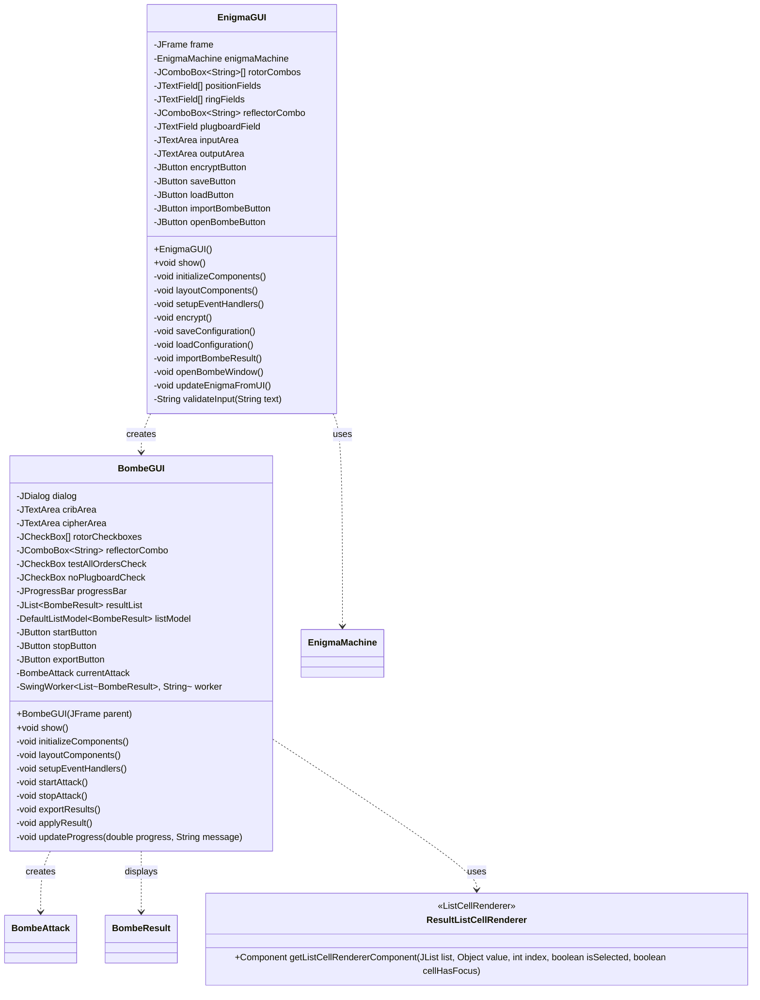
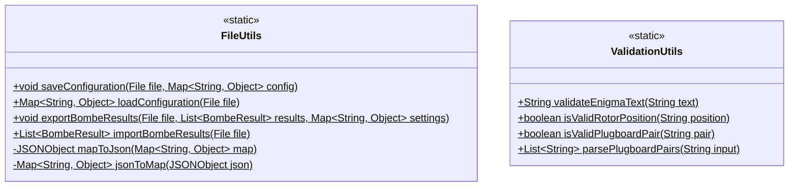
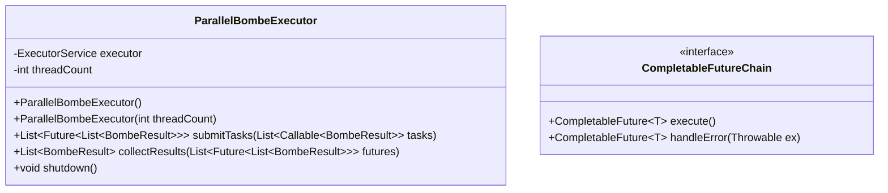
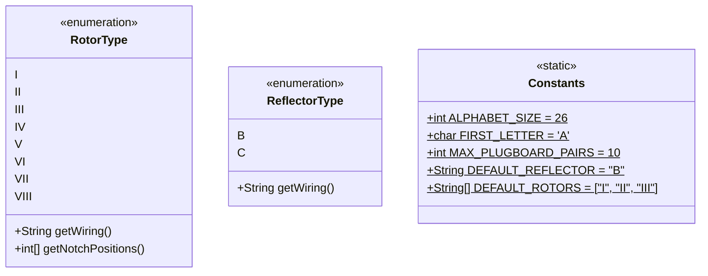
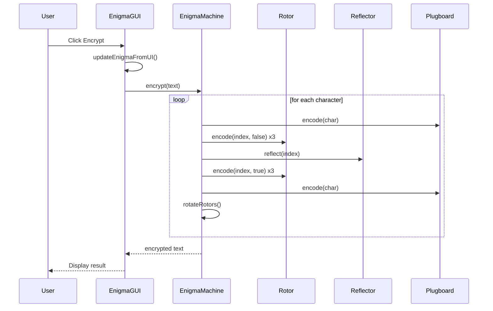
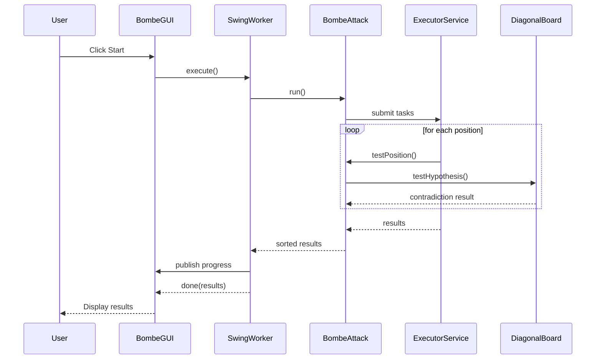
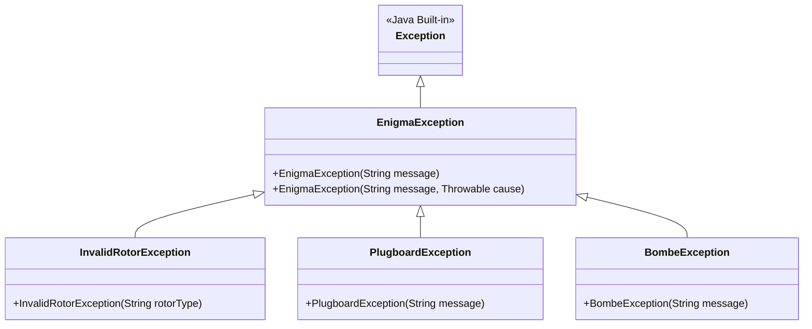

# Enigma Machine & Bombe Simulator - Java版クラス図

## 1. コアコンポーネント（com.enigma.core）

## 2. Bombe攻撃コンポーネント（com.enigma.bombe）

## 3. GUI コンポーネント（com.enigma.gui）

## 4. ユーティリティ（com.enigma.utils）

## 5. 並列処理構造

## 6. 定数とEnum

## 7. イベントフロー

### 7.1 暗号化処理フロー

### 7.2 Bombe攻撃フロー

## 8. 主要な設計パターン

### 8.1 使用パターン
1. **Builder Pattern**: EnigmaMachine構築
2. **Strategy Pattern**: 異なる攻撃アルゴリズム
3. **Observer Pattern**: 進捗通知
4. **Singleton Pattern**: RotorConfig
5. **Factory Pattern**: Rotor/Reflector生成

### 8.2 SOLID原則の適用
- **単一責任**: 各クラスが明確な責務を持つ
- **開放閉鎖**: 新しいローター/リフレクターの追加が容易
- **リスコフ置換**: インターフェースベースの設計
- **インターフェース分離**: 必要最小限のインターフェース
- **依存性逆転**: 抽象に依存し、具象に依存しない

## 9. エラーハンドリング階層

## 10. パフォーマンス最適化ポイント

1. **事前計算**: ローター配線テーブルの事前生成
2. **並列処理**: CompletableFutureによる非同期実行
3. **メモリ効率**: プリミティブ配列の使用
4. **キャッシング**: 頻繁に使用される計算結果のキャッシュ
5. **遅延評価**: 必要になるまで計算を遅延