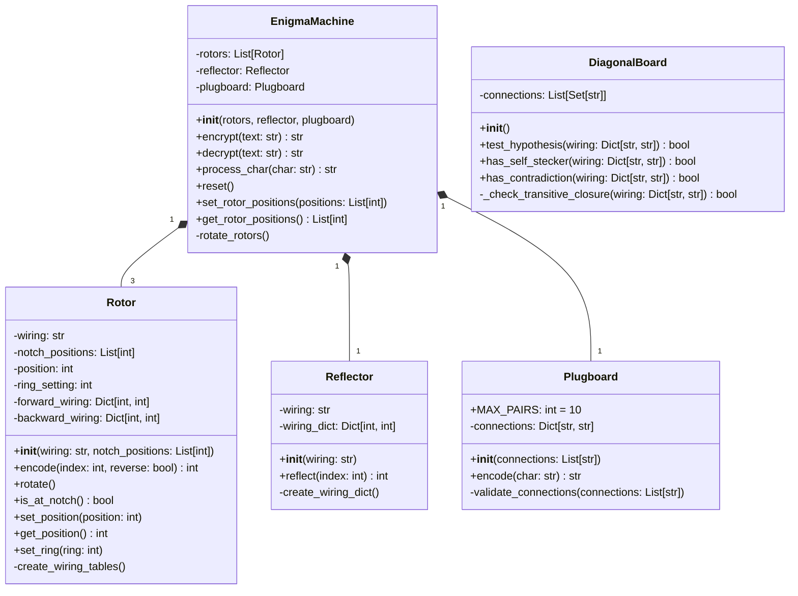
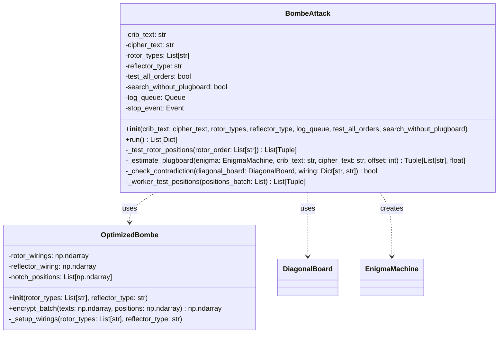
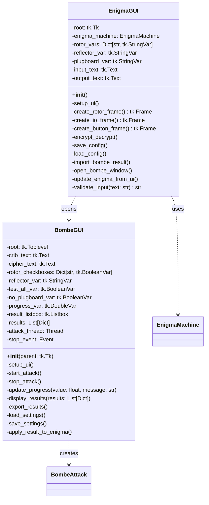
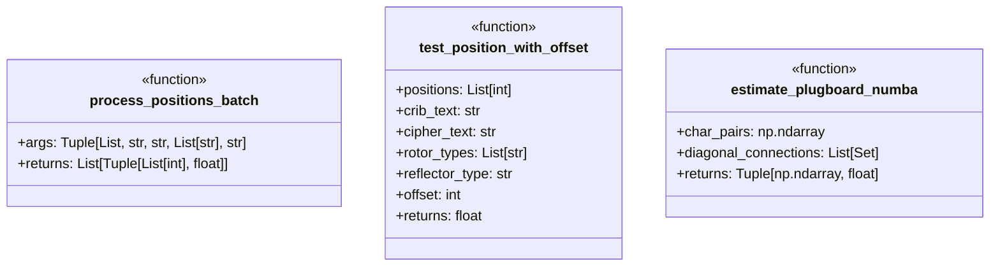
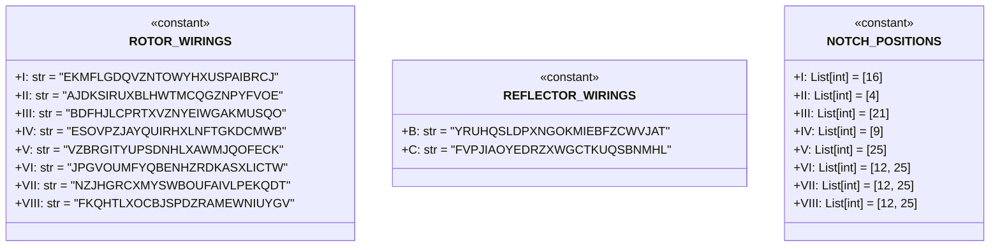
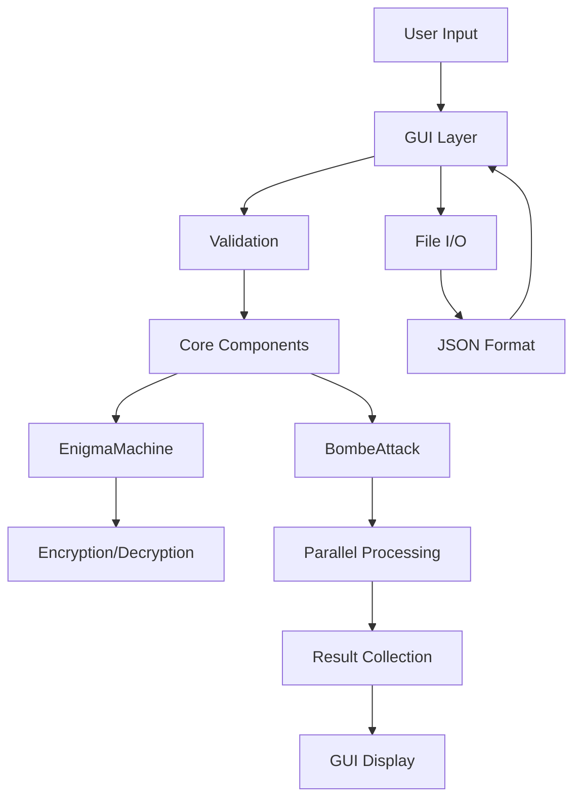

# Enigma Machine & Bombe Simulator - Python版クラス図

## 1. コアコンポーネント（core/）



## 2. Bombe攻撃コンポーネント（bombe/）



## 3. GUI コンポーネント



## 4. ユーティリティとヘルパー



## 5. 定数とデータ構造



## 6. 主要な処理フロー

### 6.1 暗号化処理
```
1. EnigmaGUI.encrypt_decrypt()
   ↓
2. EnigmaGUI.update_enigma_from_ui()
   ↓
3. EnigmaMachine.encrypt(text)
   ↓
4. For each character:
   a. Plugboard.encode(char)
   b. Rotor.encode() × 3 (forward)
   c. Reflector.reflect()
   d. Rotor.encode() × 3 (backward)
   e. Plugboard.encode(char)
   f. EnigmaMachine.rotate_rotors()
```

### 6.2 Bombe攻撃処理
```
1. BombeGUI.start_attack()
   ↓
2. BombeAttack.run()
   ↓
3. For each rotor combination:
   a. Create worker batches
   b. ProcessPoolExecutor.map(process_positions_batch)
   c. For each position:
      - test_position_with_offset()
      - estimate_plugboard_numba()
      - DiagonalBoard.test_hypothesis()
   ↓
4. BombeGUI.display_results()
```

## 7. データフロー



## 8. クラス間の関係性まとめ

1. **継承関係**: なし（シンプルな構成）
2. **コンポジション**: EnigmaMachineが各コンポーネントを保持
3. **依存関係**: GUI → Core → Attack
4. **並列処理**: BombeAttackがProcessPoolExecutorを使用

この設計により、各コンポーネントが独立して動作し、テスタビリティと保守性が確保されています。